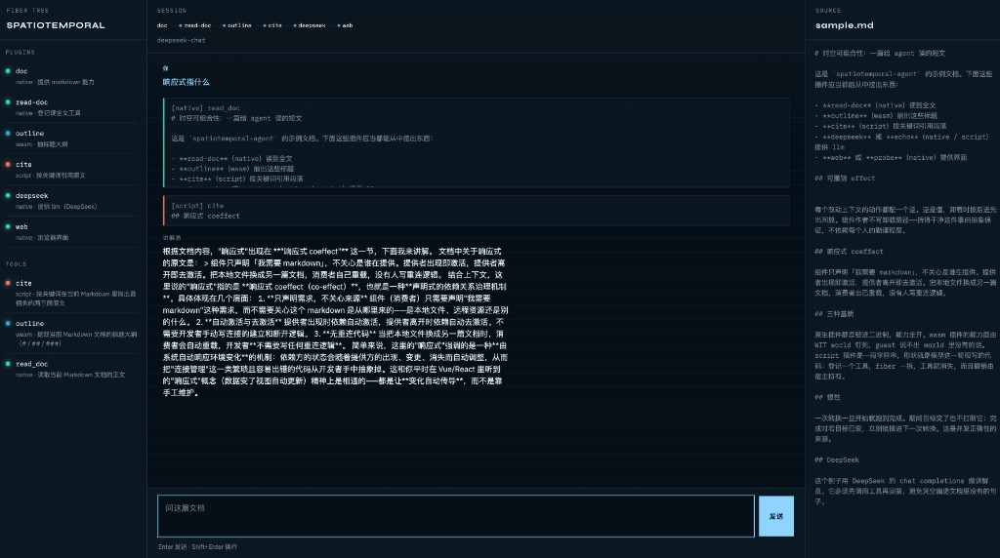

# Spatiotemporal Agent

读一篇 Markdown，用 DeepSeek 当讲解员，在浏览器里对话。宿主几乎只做两件事：建一张插件注册表，再用 `Loader` 把 `cordis.yml` 对账成一棵 fiber 树。文档、工具、LLM、界面都是插件。



## 启动

### 1. 准备工具链

需要 Rust **1.94+**（wasmtime 的 MSRV），以及 wasm guest 目标：

```bash
rustup toolchain install stable
rustup target add wasm32-wasip2
```

在仓库根目录。

### 2. 编 wasm 插件

`outline` 是 wasm 叶子工具，产物不入库，每次换机器或清 `target/` 都要编一次：

```bash
./spatiotemporal-agent/scripts/build-guests.sh
```

成功后应看到 `spatiotemporal-agent/target/guests/outline.wasm`。缺这一步，装配 `outline` 那一行会直接失败并提示你跑这个脚本。

### 3. 准备 API Key（不要写进仓库）

到 [DeepSeek 开放平台](https://platform.deepseek.com/) 建一把 key。只放进**当前 shell 的环境变量**，不要写进 `cordis.yml`、不要写进 README、不要提交 `.env`。

```bash
export DEEPSEEK_API_KEY=sk-你的key
```

可选：

| 变量 | 默认 | 作用 |
|---|---|---|
| `DEEPSEEK_API_KEY` | （必填，对话时） | Bearer token |
| `DEEPSEEK_BASE_URL` | `https://api.deepseek.com` | 网关 |
| `DEEPSEEK_MODEL` | `deepseek-chat` | 模型名 |
| `PORT` | `8787`（也可写在 `cordis.yml` 的 `ui.config.port`） | 网页端口 |

缺 key 时进程仍能起来，左侧会标「缺 DEEPSEEK_API_KEY」，发消息会得到明确错误，而不是静默失败。

### 4. 启动

仍在仓库根目录：

```bash
cargo run -p spatiotemporal-agent
```

**创造模式**（可检视运行时、热装脚本插件）：

```bash
cargo run -p spatiotemporal-agent -- --creation
```

看到 `打开 http://127.0.0.1:8787` 后，用浏览器打开。默认读 `assets/sample.md`。可以问「这篇在讲什么可撤销 effect？」，模型应先调 `outline` / `cite` / `read_doc` 再回答；左侧能看到每个工具来自 native / wasm / script 哪一种基质。

多轮对话会保留 tool 消息，模型能记住之前调用了哪些工具。会话持久化到工作区 `.agent/sessions/*.jsonl`（浏览器 localStorage 保存 session id，刷新后自动恢复）。

在工作区根目录放 `AGENTS.md` 可注入项目级指令；`system-prompt` 插件还会把各工具的 JSON schema 写进 system prompt。

换一篇自己的文档（路径相对当前工作目录）：

```bash
cargo run -p spatiotemporal-agent -- /绝对路径/某篇.md
```

### 5. 不调网络的自检

没有 key、或不想打真实 API 时：

```bash
cargo run -p spatiotemporal-agent -- --smoke
```

这会叠一层 `cordis.smoke.yml`：DeepSeek 换成脚本 `echo`，Web 换成命令行 `probe`。它会打印已装插件、真的跑一遍 `outline` 和 `cite`，并对 echo 模型 `ping` 一次，然后退出。CI 用的就是这个。

## 这棵树里有什么

`cordis.yml` 每一行是一项能力，跟 dsh 同形。换实现不是改 `name`（那是断言），而是关掉旧行再 `insert` 新行。

| id | name | 基质 | 提供 |
|---|---|---|---|
| `fs-sandbox` | `fs-sandbox` | native | `fs` 工作区沙箱 |
| `tool-fs` | `tool-fs` | native | 工具 `read` / `write` / `edit` |
| `bash-sandbox` | `bash-sandbox` | native | `shell` 工作区沙箱 |
| `tool-bash` | `tool-bash` | native | 工具 `bash` |
| `tool-web-fetch` | `tool-web-fetch` | native | 工具 `web_fetch` |
| `system-prompt` | `system-prompt` | native | `system-prompt`（AGENTS.md + schema） |
| `agent-loop` | `agent-loop` | native | `agent-loop`（可插拔多轮循环） |
| `doc` | `doc` | native | `markdown` 能力 |
| `read-doc` | `read-doc` | native | 工具 `read_doc` |
| `outline` | `wasm` | wasm | 工具 `outline` |
| `cite` | `script` | script | 工具 `cite` |
| `llm` | `deepseek` | native | `llm`（HTTP，不进 wasm） |
| `ui` | `web` | native | `surface`（听端口） |
| `creation` | `creation-tools` | native | 创造模式元工具（`--creation` 时启用） |

创造模式额外提供：`inspect_plugins` / `inspect_tools` / `inspect_config` / `define_plugin`（script / wasm / 已有 native）/ `define_script`（`define_plugin` 别名）/ `run_patch` / `revert_patch` / `reload_patch` / `undefine_plugin` / `save_patch`。

`--creation` 还会加载 `cordis.creation.yml`：启用 `patch-watcher`（监视 `cordis.patch.yml` 变更）与 `creation-tools`。动态 patch 与文件 patch 分层：`save_patch` 只持久化动态层；启动时读 `cordis.patch.yml` 作为 file 层。

wasm / script 适合叶子工具：调用稀疏、payload 小、能力面由 WIT / `host.*` 钉死。LLM 适配器和听端口的界面留在 native——前者每次要搬整份对话且需要 HTTP，后者 WASI 里没有「绑 8787」。

## 常见问题

**`编不了 …/outline.wasm`**  
还没跑 `scripts/build-guests.sh`，或缺 `wasm32-wasip2`。

**页面提示缺 key / 回复是「没有 DEEPSEEK_API_KEY」**  
当前 shell 没有导出该变量。`export` 过再重新 `cargo run`。不要把 key 写进 yaml。

**端口被占**  
`PORT=8788 cargo run -p spatiotemporal-agent`，或改 `cordis.yml` 里 `ui.config.port`。

**只想确认插件装上了**  
`--smoke`，不听端口。
